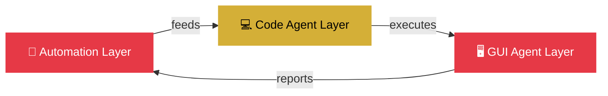

<div align="center">

<!-- Header Banner -->


<!-- Typing SVG -->
<a href="https://git.io/typing-svg">
  
</a>

<!-- Status Badges -->


<br/><br/>

<!-- Profile Stats -->


</div>

---

## 🧬 About Me

```python
class EmonHMamun:
    """AI Agent Architect | Automation Engineer | Cybersecurity Researcher"""
    
    def __init__(self):
        self.name = "Emon Hasan Mamun"
        self.location = "Bangladesh 🇧🇩"
        self.focus = ["Autonomous AI Agents", "Cybersecurity", "Automation Engineering"]
        self.current_project = "AURA — Universal Agent Framework"
        self.languages = ["Python", "JavaScript", "TypeScript", "Bash", "Go"]
        self.architecture = ["Automation Layer", "Code Agent Layer", "GUI Agent Layer"]
    
    def get_current_status(self):
        return "🟢 Building AURA — an agent that doesn't wait for instructions, it finds the work and finishes it."
    
    def get_vision(self):
        return "Every system I build starts as a question: what would this look like if no human had to touch it again?"
```

> 💡 *"In the space between code and consequence, I build what watches back."*

---

## 🛡️ Project AURA — Universal Autonomous Agent Framework

<div align="center">

### 🏗️ Three-Layer Architecture

| Layer | Purpose | Key Capabilities |
|:-----:|:-------:|:----------------:|
| 🤖 **Automation Layer** | Rule-Based Operations Engine | Workflow Automation · Task Scheduling · Event Processing · Rule Engine |
| 💻 **Code Agent Layer** | Autonomous Coding Agent | Code Generation · Auto Debugging · Self-Deployment · Test Synthesis |
| 🖥️ **GUI Agent Layer** | Interface Navigation Agent | Web Navigation · Form Automation · Screen Reading · Click Agent |

</div>



> 🎯 *"Every system I build starts as a question: what would this look like if no human had to touch it again? AURA is my answer — an agent that doesn't wait for instructions, it finds the work and finishes it."*

---

## ⚡ Tech Arsenal

<div align="center">

### 🌐 Languages


### 🤖 AI / Agents


### 🔒 Security / Ops


### 🛠️ Tools


</div>

---

## 📊 GitHub Metrics

<div align="center">
  
  
</div>

<div align="center">
  
  
</div>

<div align="center">
  
</div>

---

## 🐍 Contribution Flow

<picture>
  <source media="(prefers-color-scheme: dark)" srcset="https://raw.githubusercontent.com/emonhmamun/emonhmamun/output/github-snake-dark.svg" />
  <source media="(prefers-color-scheme: light)" srcset="https://raw.githubusercontent.com/emonhmamun/emonhmamun/output/github-snake.svg" />
  
</picture>

---

## 🎯 Current Goals

| Goal | Progress | Deadline |
|:----:|:--------:|:--------:|
| 🚀 AURA v0.1 Release | ████████░░ 80% | Q1 2025 |
| 📦 100+ GitHub Repos | ██████░░░░ 60% | 2025 |
| 🛡️ Cybersecurity Certs | ████░░░░░░ 40% | 2025 |
| ❤️ Open Source Contributions | ███████░░░ 70% | Ongoing |

---

## 🧠 Philosophy

> *"Autonomy is not the absence of control — it's the presence of intelligence."*

> *"The best systems are the ones that don't need you to exist."*

> *"In cybersecurity, paranoia is not a weakness — it's a professional requirement."*

---

## 🔗 Connect

<div align="center">

[](https://github.com/emonhmamun)
[](https://www.facebook.com/emonhasanmamun.m)
[](https://t.me/+8801767953971)
[](mailto:ehm.businessbd@gmail.com)

</div>

---

<div align="center">


</div>
