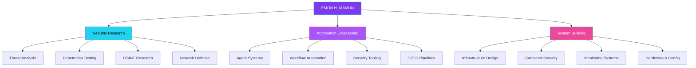
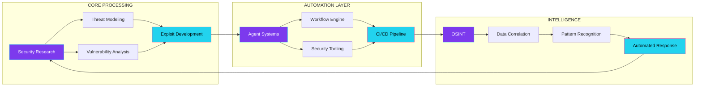
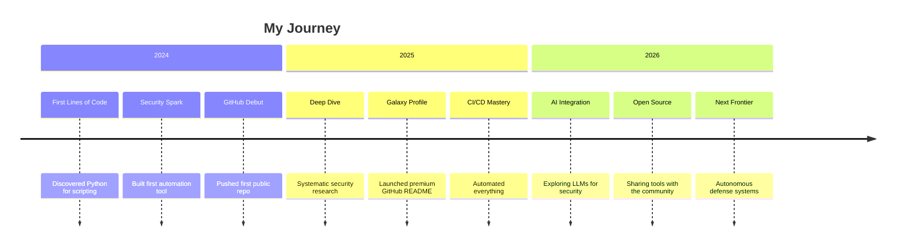

<div align="center">

<!-- ═══════════════════════════════════════════════════════════════ -->
<!-- ═══ GALAXY EDITION v2.1 — CONSTELLATION ANIMATION ════════ -->
<!-- ═══════════════════════════════════════════════════════════════ -->


<!-- ═══════════════════════════════════════════════════════════════ -->
<!-- ═══ DYNAMIC TYPING SVG — MULTI-LINE ANIMATION ════════════ -->
<!-- ═══════════════════════════════════════════════════════════════ -->
<a href="https://git.io/typing-svg">
  
</a>

<!-- ═══════════════════════════════════════════════════════════════ -->
<!-- ═══ STATUS BADGES + VISITOR COUNTER (upgraded) ════════════ -->
<!-- ═══════════════════════════════════════════════════════════════ -->
<p>
  
  
  
</p>

<p>
  
  
  
</p>

<!-- ═══════════════════════════════════════════════════════════════ -->
<!-- ═══ 🛰️ LIVE DYNAMIC BLOCK (auto-updated by GitHub Actions) ═══ -->
<!-- ═══════════════════════════════════════════════════════════════ -->

<!--DYNAMIC:START-->
<div align="center">


🛰️ **`রাত ৩:০৯` · `রবিবার, ২৩ আগস্ট ২০২৬`** *(GMT+6 · auto-refreshed every 30 min by GitHub Actions)*

> 💬 *"The only truly secure system is one that is powered off."*
> — **Gene Spafford** <sub>· via Local Vault</sub>

</div>
<!--DYNAMIC:END-->

</div>

---

<!-- ═══════════════════════════════════════════════════════════════ -->
<!-- ═══ IDENTITY BLOCK — PYTHON CLASS ══════════════════════════ -->
<!-- ═══════════════════════════════════════════════════════════════ -->

```python
class EmonHMamun:
    """Security Researcher | Automation Architect | System Builder"""

    def __init__(self):
        self.identity       = "EMON H. MAMUN"
        self.base           = "Bangladesh 🇧🇩 (GMT+6)"
        self.mindset        = "Curiosity-Driven, Not Profession-Defined"
        self.core_domains   = ["Security Research", "Automation", "Systems Engineering"]
        self.languages      = ["Python", "JavaScript", "TypeScript", "Bash", "Go"]
        self.philosophy     = "I build what watches the perimeter."
        self.current_sector = "The intersection of security, automation & AI"

    def daily_routine(self):
        return [
            "Research security patterns and threat vectors",
            "Build automation tools for personal workflow",
            "Explore the intersection of security and AI",
            "Tinker with systems and architectures",
        ]

    def current_focus(self):
        return "Developing security-first autonomous systems and tooling"

    def fun_fact(self):
        return "Not a professional developer — driven purely by curiosity"
```

---

<!-- ═══════════════════════════════════════════════════════════════ -->
<!-- ═══ ANIMATED SECTION DIVIDER — TWINKLING STARS ═════════════ -->
<!-- ═══════════════════════════════════════════════════════════════ -->


---

<!-- ═══════════════════════════════════════════════════════════════ -->
<!-- ═══ CYBERSECURITY IDENTITY SECTION ═════════════════════════ -->
<!-- ═══════════════════════════════════════════════════════════════ -->

<div align="center">

### 🛡️ SECURITY IDENTITY


<br/>


</div>

---

<!-- ═══════════════════════════════════════════════════════════════ -->
<!-- ═══ SKILL ICONS ══════════════════════════════════════════════ -->
<!-- ═══════════════════════════════════════════════════════════════ -->

<div align="center">

### ⚡ TECH ARSENAL

<a href="https://skillicons.dev">
  
</a>

<br/><br/>

<a href="https://skillicons.dev">
  
</a>

</div>

---

<!-- ═══════════════════════════════════════════════════════════════ -->
<!-- ═══ 📊 TECH RADAR — WHAT I'M LEARNING THIS MONTH ═══════════ -->
<!-- ═══════════════════════════════════════════════════════════════ -->

<div align="center">

### 📊 TECH RADAR


</div>

---

<!-- ═══════════════════════════════════════════════════════════════ -->
<!-- ═══ 🌟 SKILL POWER LEVELS — GALAXY EDITION ══════════════════ -->
<!-- ═══════════════════════════════════════════════════════════════ -->

<details>
<summary><strong>🌟 SKILL POWER LEVELS</strong> — charge-up meters</summary>

<br/>

| Skill | Class | Power Level | Meter |
|:-----|:-----:|:-----------:|:------|
| 🐍 Python | Core Weapon | S | `██████████` 95% |
| 🛡️ Security Research | Signature Move | S | `██████████` 92% |
| 🤖 Automation / Agents | Core Weapon | A+ | `████████▓░` 88% |
| 🐧 Linux / Hardening | Core Weapon | A+ | `████████▓░` 85% |
| ⚡ Bash Scripting | Fast Attack | A | `███████▓▓░` 80% |
| 🕸️ JavaScript / TS | Support | A | `███████▓▓░` 78% |
| 📦 Docker / Containers | Defense | A | `███████▓▓░` 76% |
| 🧠 AI / LLM Tooling | Leveling Up | B+ | `██████▓▓▓░` 70% |
| 🌀 Go | Leveling Up | B | `█████▓▓▓▓░` 60% |

<sub>🧬 Meter scale: hobbyist-driven, battle-tested on real problems — not certifications.</sub>

</details>

---

<!-- ═══════════════════════════════════════════════════════════════ -->
<!-- ═══ DETAILED TECH TABLE (responsive — stacked on mobile) ════ -->
<!-- ═══════════════════════════════════════════════════════════════ -->

<div align="center">

**LANGUAGES**


<br/><br/>

**SECURITY**


<br/><br/>

**FRAMEWORKS**


<br/><br/>

**INFRASTRUCTURE**


<br/><br/>

**AI / AUTOMATION**


</div>

---

<!-- ═══════════════════════════════════════════════════════════════ -->
<!-- ═══ ANIMATED SECTION DIVIDER — FIRE ANIMATION ══════════════ -->
<!-- ═══════════════════════════════════════════════════════════════ -->


---

<!-- ═══════════════════════════════════════════════════════════════ -->
<!-- ═══ TERMINAL SIMULATION ══════════════════════════════════════ -->
<!-- ═══════════════════════════════════════════════════════════════ -->

<details>
<summary><strong>🕹️ TERMINAL SESSION</strong> — <code>whoami && cat /etc/interests</code></summary>

```
┌─────────────────────────────────────────────────────────────┐
│  GALAXY TERMINAL — emon@nebula:~$                           │
├─────────────────────────────────────────────────────────────┤
│                                                             │
│  $ whoami                                                   │
│  emonhmamun                                                 │
│                                                             │
│  $ cat /etc/profession                                      │
│  Security Researcher | Automation Architect | System Builder │
│                                                             │
│  $ cat /etc/mindset                                         │
│  Curiosity-driven, not profession-defined                   │
│  "I build what watches the perimeter."                      │
│                                                             │
│  $ ls ~/projects/                                           │
│  [security-tools] [automation-agents] [system-utilities]    │
│  [research-notes]  [personal-tooling]  [experiment-labs]    │
│                                                             │
│  $ ps aux | grep -i "learning"                              │
│  emon   4096  99.9  Security Research      [RUNNING]        │
│  emon   4097  85.2  Automation Engineering [RUNNING]        │
│  emon   4098  72.6  System Architecture    [RUNNING]        │
│  emon   4099  61.4  AI / ML Exploration    [RUNNING]        │
│                                                             │
│  $ df -h /curiosity                                         │
│  Filesystem      Size  Used Avail Use% Mounted on           │
│  /dev/mind       ∞     ∞      0   100% ~/nebula             │
│                                                             │
│  $ uptime                                                   │
│  Always learning. Always building. Never stopping.           │
│                                                             │
│  $ echo $PHILOSOPHY                                         │
│  "Every system I build starts as a question."               │
│  "What would this look like if it could defend itself?"      │
│                                                             │
│  $ exit                                                     │
│  Connection preserved. The perimeter holds.                 │
│                                                             │
└─────────────────────────────────────────────────────────────┘
```

</details>

---

<!-- ═══════════════════════════════════════════════════════════════ -->
<!-- ═══ SECURITY ARCHITECTURE DIAGRAM ══════════════════════════ -->
<!-- ═══════════════════════════════════════════════════════════════ -->

<details>
<summary><strong>🗺️ SECURITY ARCHITECTURE</strong> — Systems & Layers</summary>



</details>

---

<!-- ═══════════════════════════════════════════════════════════════ -->
<!-- ═══ ANIMATED SECTION DIVIDER — CONSTELLATION ══════════════ -->
<!-- ═══════════════════════════════════════════════════════════════ -->


---

<!-- ═══════════════════════════════════════════════════════════════ -->
<!-- ═══ CONTRIBUTION GALAXY — FIXED URLs ══════════════════════ -->
<!-- ═══════════════════════════════════════════════════════════════ -->

<div align="center">

### 🌌 CONTRIBUTION GALAXY

<!-- GitHub Stats + Top Languages Pie (reliable fork) -->


<br/><br/>

<!-- Streak Stats (MIGRATED to demolab — herokuapp is dead) -->


<br/><br/>

<!-- Activity Graph -->


<br/><br/>

<!-- Contribution Snake Animation -->


</div>

---

<!-- ═══════════════════════════════════════════════════════════════ -->
<!-- ═══ 🏆 TROPHY CABINET (NEW — auto-unlocked from GitHub data) ══ -->
<!-- ═══════════════════════════════════════════════════════════════ -->

<div align="center">

### 🏆 TROPHY CABINET

<!--
🏆 TO ACTIVATE:
The trophy service (github-profile-trophy.vercel.app) intermittently rate-limits.
If trophies don't show, try refreshing later or deploy your own instance:
https://github.com/ryo-ma/github-profile-trophy
-->


</div>

---

<!-- ═══════════════════════════════════════════════════════════════ -->
<!-- ═══ RECENT ACTIVITY — auto-updated by workflow ═════════════ -->
<!-- ═══════════════════════════════════════════════════════════════ -->

## 📡 RECENT ACTIVITY

<!--START_SECTION:activity-->
<!--END_SECTION:activity-->

<sub>⚡ Auto-refreshed every 6 hours by GitHub Actions.</sub>

---

<!-- ═══════════════════════════════════════════════════════════════ -->
<!-- ═══ 🔗 RECOMMENDED REPOS (NEW — curated tools) ══════════════ -->
<!-- ═══════════════════════════════════════════════════════════════ -->

<details>
<summary><strong>🔗 RECOMMENDED TOOLS</strong> — <em>tools I use & recommend</em></summary>

<br/>

| Tool | Purpose | Why I Use It |
|:-----|:--------|:-------------|
| [**Nuclei**](https://github.com/projectdiscovery/nuclei) | Vulnerability scanner | Fast, template-based, community-driven |
| [**Nmap**](https://nmap.org/) | Network discovery | The Swiss army knife of network security |
| [**Burp Suite**](https://portswigger.net/burp) | Web proxy | Essential for web app testing |
| [**Grafana**](https://grafana.com/) | Monitoring dashboards | Beautiful data visualization |
| [**n8n**](https://n8n.io/) | Workflow automation | Visual, self-hosted, powerful |
| [**Neovim**](https://neovim.io/) | Code editor | Extensible, terminal-native, fast |

<sub>💡 These are tools I personally use and recommend — not sponsored.</sub>

</details>

---

<!-- ═══════════════════════════════════════════════════════════════ -->
<!-- ═══ SYSTEM STATUS — PREMIUM DYNAMIC BADGES ════════════════ -->
<!-- ═══════════════════════════════════════════════════════════════ -->

<div align="center">

### 🖥️ SYSTEM STATUS


<br/><br/>


<br/><br/>


<br/><br/>

<!-- NEW: Live Threat Level Indicator -->


</div>

---

<!-- ═══════════════════════════════════════════════════════════════ -->
<!-- ═══ DYNAMIC TYPING — QUOTE ROTATION ════════════════════════ -->
<!-- ═══════════════════════════════════════════════════════════════ -->

<div align="center">

<a href="https://git.io/typing-svg">
  
</a>

</div>

---

<!-- ═══════════════════════════════════════════════════════════════ -->
<!-- ═══ NEURAL NETWORK VISUALIZATION ════════════════════════════ -->
<!-- ═══════════════════════════════════════════════════════════════ -->

<details>
<summary><strong>🧠 NEURAL NETWORK</strong> — Knowledge Interconnections</summary>



</details>

---

<!-- ═══════════════════════════════════════════════════════════════ -->
<!-- ═══ CURRENT FOCUS ══════════════════════════════════════════ -->
<!-- ═══════════════════════════════════════════════════════════════ -->

### 🎯 CURRENT FOCUS

| Domain | Direction | Status |
|:------:|:---------:|:------:|
| Security Research | Threat analysis, OSINT, penetration testing methodologies | 🟣 Active |
| Automation Systems | Building autonomous security and workflow tools | 🔵 Building |
| System Architecture | Designing secure, resilient infrastructure patterns | 🟣 Exploring |
| AI Integration | Applying ML/AI to security analysis and automation | 🩷 Experimenting |

---

<!-- ══════════════════════════════════════════════════ -->
<!-- ══ ⏰ TIMELINE — MY JOURNEY (NEW) ═════════════════════ -->
<!-- ═════════════════════════════════════════════ -->

<details>
<summary><strong>⏰ TIMELINE</strong> — <em>how I got here</em></summary>



</details>

---

<!-- ═══════════════════════════════════════════════════════════════ -->
<!-- ═══ 📈 DEV METRICS (NEW — quantitative stats) ═══════════════ -->
<!-- ═══════════════════════════════════════════════════════════════ -->

<div align="center">

### 📈 DEV METRICS


<br/>


</div>

---

<!-- ═══════════════════════════════════════════════════════════════ -->
<!-- ═══ PRINCIPLES & PHILOSOPHY ══════════════════════════════════ -->
<!-- ═══════════════════════════════════════════════════════════════ -->

> *"Every system I build starts as a question: what would this look like if it could defend itself?"*

> *"Not a professional developer — driven purely by curiosity. Every tool I make solves a problem I actually have."*

> *"In the space between code and consequence, I build what watches the perimeter."*

---

<!-- ═══════════════════════════════════════════════════════════════ -->
<!-- ═══ 🔍 NOW — WHAT I'M CURRENTLY UP TO (NEW) ══════════════════ -->
<!-- ═══════════════════════════════════════════════════════════════ -->

<details>
<summary><strong>🔍 CURRENTLY</strong> — <em>what I'm working on right now</em></summary>

<br/>

| 💻 Building | 📖 Learning | 🎯 Exploring |
|:------------|:-------------|:--------------|
| Autonomous security agents | AI-powered threat detection | Container escape techniques |
| Personal automation toolkit | Go concurrency patterns | Zero-knowledge proofs |
| GitHub Actions workflows | LangChain agent architectures | eBPF for runtime security |

<sub>⏰ This section is updated manually. Last refreshed: see the Live Dynamic Block above.</sub>

</details>

---

<!-- ═══════════════════════════════════════════════════════════════ -->
<!-- ═══ 🏆 ACHIEVEMENT WALL — GAMIFIED ══════════════════════════ -->
<!-- ═══════════════════════════════════════════════════════════════ -->

<div align="center">

### 🏆 ACHIEVEMENT WALL


<br/><br/>


<br/><br/>

<details>
<summary>🔒 <strong>SECRET ACHIEVEMENTS</strong> — unlock by exploring</summary>

<br/>


<sub>Congrats, visitor — you dug deeper than 99%. The perimeter respects you. 🫡</sub>

</details>

</div>

---

<!-- ═══════════════════════════════════════════════════════════════ -->
<!-- ═══ 🎵 SPOTIFY NOW PLAYING (ready-to-activate) ═══════════════ -->
<!-- ═══════════════════════════════════════════════════════════════ -->

<details>
<summary><strong>🎵 NOW PLAYING</strong> — <em>what's on my speakers</em></summary>

<br/>

<!--
🎙️ TO ACTIVATE:
1. Go to https://spotify-github-profile.vercel.app and login with Spotify
2. Add the generated image URL below (replace the placeholder comment)
3. Or deploy your own instance: https://github.com/kittinan/spotify-github-profile

Example:

-->

<div align="center">


<br/>

<sub>🎙️ Spotify integration is ready. Connect your account to show live "now playing" data here. <a href="https://github.com/kittinan/spotify-github-profile">Setup Guide</a></sub>

</div>

</details>

---

<!-- ═══════════════════════════════════════════════════════════════ -->
<!-- ═══ 📰 LATEST WRITING (ready-to-activate) ════════════════════ -->
<!-- ═══════════════════════════════════════════════════════════════ -->

<details>
<summary><strong>📰 LATEST WRITING</strong> — <em>recent blog posts & articles</em></summary>

<br/>

<!--
🎙️ TO ACTIVATE:
1. Fork https://github.com/gautamkrishnar/blog-post-workflow
2. Add your blog RSS feed URL as a GitHub secret (BLOG_RSS_FEED)
3. Add the workflow to .github/workflows/
4. Uncomment the section markers below

Supported: Dev.to, Medium, Hashnode, WordPress, any RSS feed

Example workflow generates content between these markers:
-->

<!-- BLOG-POST-LIST:START -->
<!-- BLOG-POST-LIST:END -->

<div align="center">


<br/>

<sub>📱 Blog post cards will auto-appear here once the workflow is activated. <a href="https://github.com/gautamkrishnar/blog-post-workflow">Setup Guide</a></sub>

</div>

---

<!-- ════════════════════════════════════════════════════ -->
<!-- ══ 📝 GITHUB CARD (NEW) ═════════════════════════════ -->
<!-- ══════════════════════════════════════════════ -->

<div align="center">

### 📝 GITHUB CARD

<a href="https://github.com/emonhmamun">
  
</a>

</details>

---

<!-- ═══════════════════════════════════════════════════════════════ -->
<!-- ═══ 🎮 FUN ZONE — CIPHER CHALLENGE ══════════════════════════ -->
<!-- ═══════════════════════════════════════════════════════════════ -->

<details>
<summary><strong>🎮 FUN ZONE</strong> — security puzzles & interactive links</summary>

<br/>

**🔑 ACCESS CHALLENGE** — Can you find the 3 hidden sections on this profile?
<sub>Hint: expand every `<details>` block. The perimeter rewards the curious.</sub>

<br/>

<br/>

**🔐 CIPHER CHALLENGE** — the message below is encoded with **ROT13** (the classic Caesar shift).
Decode it at [rot13.com](https://rot13.com) or with `echo ... | tr 'A-Za-z' 'N-ZA-Mn-za-m'`:

```
GUR CREVZRGRE UBYQF - PHEVBFVGL VF GUR GEHR SVERJNYY
```

<details>
<summary>🤫 <em>Reveal the decrypted message</em></summary>

> **"THE PERIMETER HOLDS — CURIOSITY IS THE TRUE FIREWALL"**

</details>

<br/>

**🎲 COIN FLIP** — indecisive? Let entropy decide: [Flip it](https://en.wikipedia.org/wiki/Special:Random)

**🕵️ LIVE THREAT FEED** — watch the internet's background noise: [cybermap.kaspersky.com](https://cybermap.kaspersky.com/)

**🌍 SHODAN VIEW** — explore exposed devices worldwide: [shodan.io](https://www.shodan.io/)

**🧪 MALWARE TRAFFIC** — real-time malware distribution map: [malware-traffic-analysis.net](https://www.malware-traffic-analysis.net/)

</details>

---

<!-- ═══════════════════════════════════════════════════════════════ -->
<!-- ═══ ❓ FAQ ACCORDION (NEW — visitor Q&A) ══════════════════════ -->
<!-- ═══════════════════════════════════════════════════════════════ -->

<details>
<summary><strong>❓ FREQUENTLY ASKED</strong> — things people ask me</summary>

<br/>

<details>
<summary>❓ <strong>Are you available for collaboration or freelance work?</strong></summary>

💡 Open to collaboration on security research, automation projects, and open-source tooling. Reach out via Telegram or email — let's talk about the problem first.

</details>

<br/>

<details>
<summary>❓ <strong>What editor and OS do you use daily?</strong></summary>

💻 **Neovim** for quick edits and terminal workflows, **VS Code** for larger projects. **Linux** (Arch/Debian) as the primary OS. Everything runs in containers when possible.

</details>

<br/>

<details>
<summary>❓ <strong>How do you learn cybersecurity?</strong></summary>

🔍 Hands-on. HTB boxes, CTF challenges, reading source code, building tools for my own problems, and breaking things on personal labs before they break in production.

</details>

<br/>

<details>
<summary>❓ <strong>Can I use your tools or projects?</strong></summary>

📦 Absolutely. Everything open-source is MIT/Apache licensed unless stated otherwise. Star the repo if it helps you — that's the only payment I ask.

</details>

<br/>

<details>
<summary>❓ <strong>What's your take on AI in security?</strong></summary>

🤖 AI is a force multiplier, not a replacement. I use LLMs for code assistance, threat analysis acceleration, and automating repetitive recon. But the human intuition for creative exploitation? That stays human.

</details>

</details>

---

<!-- ═══════════════════════════════════════════════════════════════ -->
<!-- ═══ ANIMATED SECTION DIVIDER — BLINKING STARS ═══════════════ -->
<!-- ═══════════════════════════════════════════════════════════════ -->


---

<!-- ═══════════════════════════════════════════════════════════════ -->
<!-- ═══ ⏱️ WAKATIME — RESERVED SLOT (activate later) ═════════════ -->
<!-- ═══════════════════════════════════════════════════════════════ -->

<details>
<summary><strong>⏱️ CODING TIME STATS</strong> — <em>reserved · activation pending</em></summary>

<br/>

<!--
🚀 TO ACTIVATE (later):
1. Create a free account at https://wakatime.com and install the plugin in your editor
2. Go to wakatime.com/settings/api-key and copy your API key
3. Add it as a repository secret named WAKATIME_API_KEY (GitHub → Settings → Secrets and variables → Actions)
4. Uncomment the image below and this section will light up with live coding-time stats
-->

<!-- UNCOMMENT AFTER ADDING WAKATIME_API_KEY SECRET:

-->

**⏳ Coming soon:** *live coding-time analytics — which languages I actually grind, hour by hour.*

<sub>Hook: [wakatime.com](https://wakatime.com) · Plugin auto-tracks editor time · badge lights up once the API key lands in repo secrets.</sub>

</details>

---

<!-- ═══════════════════════════════════════════════════════════════ -->
<!-- ═══ DETAILED ABOUT SECTION ════════════════════════════════════ -->
<!-- ═══════════════════════════════════════════════════════════════ -->

<details>
<summary><strong>🌌 MORE ABOUT ME</strong></summary>

<br/>

**Background:**
- Based in Bangladesh, exploring cybersecurity and automation
- Curiosity-driven — not profession-defined
- Build tools for myself; share what might help others

**Approach:**
- Security-first thinking applied to everything I build
- Automation where it removes repetitive human effort
- Systems designed to be resilient and self-monitoring
- Constant learning through hands-on experimentation

**Interests:**
- Threat intelligence and attack surface analysis
- Building autonomous agents for security workflows
- Infrastructure hardening and container security
- Reverse engineering and vulnerability research
- Open-source security tooling development

**What I Don't Do:**
- I don't build to impress — I build to solve
- I don't follow trends — I follow problems
- I don't chase titles — I chase understanding

</details>

---

<!-- ═══════════════════════════════════════════════════════════════ -->
<!-- ═══ 📡 CONNECT ════════════════════════════════════════════════ -->
<!-- ═══════════════════════════════════════════════════════════════ -->

<div align="center">

### 📡 CONNECT

<a href="https://github.com/emonhmamun">
  
</a>
<a href="https://www.facebook.com/emonhasanmamun.m">
  
</a>
<a href="https://t.me/+8801767953971">
  
</a>
<a href="mailto:ehm.businessbd@gmail.com">
  
</a>

<br/><br/>

<!-- NEW: Additional Social Badges -->
<a href="https://x.com/">
  
</a>
<a href="https://linkedin.com/in/">
  
</a>

<sub><em>X / LinkedIn — update the URL above with your actual profile links</em></sub>

</div>

---

<!-- ═══════════════════════════════════════════════════════════════ -->
<!-- ═══ 🌐 AT A GLANCE ═════════════════════════════════════════ -->
<!-- ═══════════════════════════════════════════════════════════════ -->

<div align="center">

### 🌐 AT A GLANCE


</div>

---

<!-- ═══════════════════════════════════════════════════════════════ -->
<!-- ═══ PREMIUM FOOTER BANNER ════════════════════════════════════ -->
<!-- ═══════════════════════════════════════════════════════════════ -->

<div align="center">


<br/>


</div>
