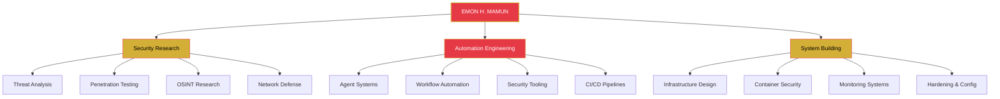
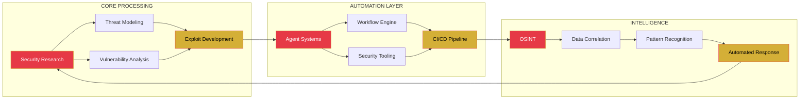

<div align="center">

<!-- ═══════════════════════════════════════════════════════════════ -->
<!-- ═══ PREMIUM HEADER BANNER — CONSTELLATION ANIMATION ════════ -->
<!-- ═══════════════════════════════════════════════════════════════ -->


<!-- ═══════════════════════════════════════════════════════════════ -->
<!-- ═══ DYNAMIC TYPING SVG — MULTI-LINE ANIMATION ═════════════ -->
<!-- ═══════════════════════════════════════════════════════════════ -->
<a href="https://git.io/typing-svg">
  
</a>

<!-- ═══════════════════════════════════════════════════════════════ -->
<!-- ═══ STATUS BADGES + VISITOR COUNTER ════════════════════════ -->
<!-- ═══════════════════════════════════════════════════════════════ -->
<p>
  
  
  
</p>

<p>
  
  
  
</p>

</div>

---

<!-- ═══════════════════════════════════════════════════════════════ -->
<!-- ═══ IDENTITY BLOCK — PYTHON CLASS ══════════════════════════ -->
<!-- ═══════════════════════════════════════════════════════════════ -->

```python
class EmonHMamun:
    """Security Researcher | Automation Architect | System Builder"""

    def __init__(self):
        self.identity       = "EMON H. MAMUN"
        self.base           = "Bangladesh"
        self.mindset        = "Curiosity-Driven, Not Profession-Defined"
        self.core_domains   = ["Security Research", "Automation", "Systems Engineering"]
        self.languages      = ["Python", "JavaScript", "TypeScript", "Bash", "Go"]
        self.philosophy     = "I build what watches the perimeter."

    def daily_routine(self):
        return [
            "Research security patterns and threat vectors",
            "Build automation tools for personal workflow",
            "Explore the intersection of security and AI",
            "Tinker with systems and architectures",
        ]

    def current_focus(self):
        return "Developing security-first autonomous systems and tooling"

    def fun_fact(self):
        return "Not a professional developer — driven purely by curiosity"
```

---

<!-- ═══════════════════════════════════════════════════════════════ -->
<!-- ═══ ANIMATED SECTION DIVIDER — TWINKLING STARS ════════════ -->
<!-- ═══════════════════════════════════════════════════════════════ -->


---

<!-- ═══════════════════════════════════════════════════════════════ -->
<!-- ═══ CYBERSECURITY IDENTITY SECTION ═════════════════════════ -->
<!-- ═══════════════════════════════════════════════════════════════ -->

<div align="center">

### SECURITY IDENTITY


<br/>


</div>

---

<!-- ═══════════════════════════════════════════════════════════════ -->
<!-- ═══ SKILL ICONS (ALL VERIFIED WORKING) ═════════════════════ -->
<!-- ═══════════════════════════════════════════════════════════════ -->

<div align="center">

### TECH ARSENAL

<a href="https://skillicons.dev">
  
</a>

<br/><br/>

<a href="https://skillicons.dev">
  
</a>

</div>

---

<!-- ═══════════════════════════════════════════════════════════════ -->
<!-- ═══ DETAILED TECH TABLE ════════════════════════════════════ -->
<!-- ═══════════════════════════════════════════════════════════════ -->

<table>
<tr>
<td align="center" width="20%">

**LANGUAGES**


</td>
<td align="center" width="20%">

**SECURITY**


</td>
<td align="center" width="20%">

**FRAMEWORKS**


</td>
<td align="center" width="20%">

**INFRASTRUCTURE**


</td>
<td align="center" width="20%">

**AI / AUTOMATION**


</td>
</tr>
</table>

---

<!-- ═══════════════════════════════════════════════════════════════ -->
<!-- ═══ ANIMATED SECTION DIVIDER — FIRE ANIMATION ═════════════ -->
<!-- ═══════════════════════════════════════════════════════════════ -->


---

<!-- ═══════════════════════════════════════════════════════════════ -->
<!-- ═══ TERMINAL SIMULATION ════════════════════════════════════ -->
<!-- ═══════════════════════════════════════════════════════════════ -->

<details>
<summary><strong>TERMINAL SESSION</strong> — <code>whoami && cat /etc/interests</code></summary>

```
┌─────────────────────────────────────────────────────────────┐
│  SECURITY TERMINAL — emon@kali:~$                           │
├─────────────────────────────────────────────────────────────┤
│                                                             │
│  $ whoami                                                   │
│  emonhmamun                                                 │
│                                                             │
│  $ cat /etc/profession                                      │
│  Security Researcher | Automation Architect | System Builder │
│                                                             │
│  $ cat /etc/mindset                                         │
│  Curiosity-driven, not profession-defined                   │
│  "I build what watches the perimeter."                      │
│                                                             │
│  $ ls ~/projects/                                           │
│  [security-tools] [automation-agents] [system-utilities]    │
│  [research-notes]  [personal-tooling]  [experiment-labs]    │
│                                                             │
│  $ ps aux | grep -i "learning"                              │
│  emon   4096  99.9  Security Research      [RUNNING]        │
│  emon   4097  85.2  Automation Engineering [RUNNING]        │
│  emon   4098  72.6  System Architecture    [RUNNING]        │
│  emon   4099  61.4  AI / ML Exploration    [RUNNING]        │
│                                                             │
│  $ uptime                                                   │
│  Always learning. Always building. Never stopping.           │
│                                                             │
│  $ echo $PHILOSOPHY                                         │
│  "Every system I build starts as a question."               │
│  "What would this look like if it could defend itself?"      │
│                                                             │
│  $ exit                                                     │
│  Connection preserved. The perimeter holds.                 │
│                                                             │
└─────────────────────────────────────────────────────────────┘
```

</details>

---

<!-- ═══════════════════════════════════════════════════════════════ -->
<!-- ═══ SECURITY ARCHITECTURE DIAGRAM ══════════════════════════ -->
<!-- ═══════════════════════════════════════════════════════════════ -->

<details>
<summary><strong>SECURITY ARCHITECTURE</strong> — Systems & Layers</summary>



</details>

---

<!-- ═══════════════════════════════════════════════════════════════ -->
<!-- ═══ ANIMATED SECTION DIVIDER — CONSTELLATION ══════════════ -->
<!-- ═══════════════════════════════════════════════════════════════ -->


---

<!-- ═══════════════════════════════════════════════════════════════ -->
<!-- ═══ CONTRIBUTION FLOW — PREMIUM MULTI-CARD LAYOUT ════════ -->
<!-- ═══════════════════════════════════════════════════════════════ -->

<div align="center">

### CONTRIBUTION FLOW

<!-- GitHub Stats + Top Languages -->


<br/><br/>

<!-- Streak Stats -->


<br/><br/>

<!-- Activity Graph -->


<br/><br/>

<!-- Contribution Snake Animation -->


</div>

---

<!-- ═══════════════════════════════════════════════════════════════ -->
<!-- ═══ ANIMATED SECTION DIVIDER — BLINKING STARS ═════════════ -->
<!-- ═══════════════════════════════════════════════════════════════ -->


---

<!-- ═══════════════════════════════════════════════════════════════ -->
<!-- ═══ SYSTEM STATUS — PREMIUM DYNAMIC BADGES ════════════════ -->
<!-- ═══════════════════════════════════════════════════════════════ -->

<div align="center">

### SYSTEM STATUS


<br/><br/>


<br/><br/>


</div>

---

<!-- ═══════════════════════════════════════════════════════════════ -->
<!-- ═══ DYNAMIC TYPING — QUOTE ROTATION ═══════════════════════ -->
<!-- ═══════════════════════════════════════════════════════════════ -->

<div align="center">

<a href="https://git.io/typing-svg">
  
</a>

</div>

---

<!-- ═══════════════════════════════════════════════════════════════ -->
<!-- ═══ NEURAL NETWORK VISUALIZATION ═══════════════════════════ -->
<!-- ═══════════════════════════════════════════════════════════════ -->

<details>
<summary><strong>NEURAL NETWORK</strong> — Knowledge Interconnections</summary>



</details>

---

<!-- ═══════════════════════════════════════════════════════════════ -->
<!-- ═══ CURRENT FOCUS TABLE ════════════════════════════════════ -->
<!-- ═══════════════════════════════════════════════════════════════ -->

### CURRENT FOCUS

| Domain | Direction | Status |
|:------:|:---------:|:------:|
| Security Research | Threat analysis, OSINT, penetration testing methodologies | Active |
| Automation Systems | Building autonomous security and workflow tools | Building |
| System Architecture | Designing secure, resilient infrastructure patterns | Exploring |
| AI Integration | Applying ML/AI to security analysis and automation | Experimenting |

---

<!-- ═══════════════════════════════════════════════════════════════ -->
<!-- ═══ PRINCIPLES & PHILOSOPHY ════════════════════════════════ -->
<!-- ═══════════════════════════════════════════════════════════════ -->

> *"Every system I build starts as a question: what would this look like if it could defend itself?"*

> *"Not a professional developer — driven purely by curiosity. Every tool I make solves a problem I actually have."*

> *"In the space between code and consequence, I build what watches the perimeter."*

---

<!-- ═══════════════════════════════════════════════════════════════ -->
<!-- ═══ ANIMATED SECTION DIVIDER — RAIN ANIMATION ═════════════ -->
<!-- ═══════════════════════════════════════════════════════════════ -->


---

<!-- ═══════════════════════════════════════════════════════════════ -->
<!-- ═══ DETAILED ABOUT SECTION ═════════════════════════════════ -->
<!-- ═══════════════════════════════════════════════════════════════ -->

<details>
<summary><strong>MORE ABOUT ME</strong></summary>

<br/>

**Background:**
- Based in Bangladesh, exploring cybersecurity and automation
- Curiosity-driven — not profession-defined
- Build tools for myself; share what might help others

**Approach:**
- Security-first thinking applied to everything I build
- Automation where it removes repetitive human effort
- Systems designed to be resilient and self-monitoring
- Constant learning through hands-on experimentation

**Interests:**
- Threat intelligence and attack surface analysis
- Building autonomous agents for security workflows
- Infrastructure hardening and container security
- Reverse engineering and vulnerability research
- Open-source security tooling development

**What I Don't Do:**
- I don't build to impress — I build to solve
- I don't follow trends — I follow problems
- I don't chase titles — I chase understanding

</details>

---

<!-- ═══════════════════════════════════════════════════════════════ -->
<!-- ═══ CONNECT ═════════════════════════════════════════════════ -->
<!-- ═══════════════════════════════════════════════════════════════ -->

<div align="center">

### CONNECT

<a href="https://github.com/emonhmamun">
  
</a>
<a href="https://www.facebook.com/emonhasanmamun.m">
  
</a>
<a href="https://t.me/+8801767953971">
  
</a>
<a href="mailto:ehm.businessbd@gmail.com">
  
</a>

</div>

---

<!-- ═══════════════════════════════════════════════════════════════ -->
<!-- ═══ PREMIUM FOOTER BANNER ══════════════════════════════════ -->
<!-- ═══════════════════════════════════════════════════════════════ -->

<div align="center">


<br/>


</div>
