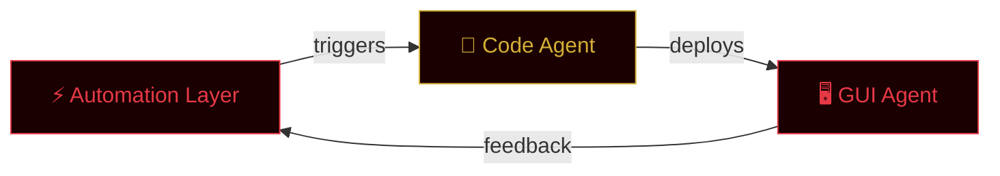

<div align="center">


<a href="https://git.io/typing-svg">
  
</a>

<br/>


</div>


<div align="center">

**Architecting autonomous AI systems and exploring the frontier of cybersecurity —**
**where automation meets intention.**

`Cybersecurity`&nbsp;&nbsp;`Autonomous AI Agents`&nbsp;&nbsp;`Automation Engineering`&nbsp;&nbsp;`Red Team Ops`

</div>


## 🧠 About Me

<div align="center">


</div>

<br clear="both"/>

<div align="center">

| 🎯 Focus | 🔬 Research | 🏗️ Building |
|:---:|:---:|:---:|
| Autonomous AI Agents | LLM Security & Red Teaming | AURA Framework |
| Cybersecurity Automation | Agent Architecture Patterns | Universal Agent Platform |
| System Orchestration | AI Safety & Alignment | Production-Grade AI Systems |

</div>


## 🚀 AURA — Universal Autonomous Agent

<div align="center">


</div>

> **AURA** is a three-layer universal autonomous agent built to complete any online task without human intervention — an architecture where intelligence flows from rules to reasoning to action.

<table>
<tr>
<td width="33%" align="center">

### ⚡ Automation Layer
Rule-based operations engine

```
Workflow Engine
Task Scheduler  
Event Processor
Rule Engine
```

</td>
<td width="33%" align="center">

### 🧠 Code Agent Layer
Autonomous coding agent

```
Code Generation
Auto Debugging
Self-Deployment
Test Synthesis
```

</td>
<td width="33%" align="center">

### 🖥️ GUI Agent Layer
Interface navigation agent

```
Web Navigation
Form Automation
Screen Reading
Click Agent
```

</td>
</tr>
</table>

<div align="center">



</div>


## 💡 Vision

<div align="center">

> *"Every system I build starts as a question: what would this look like if no human had to touch it again?*
> *AURA is my answer — an agent that doesn't wait for instructions, it finds the work and finishes it."*

</div>


## 🛠️ Tech Arsenal

<div align="center">

### Languages


### AI & Agents


### Security & Ops


### Tools & IDE


</div>


## 📊 Contribution Flow

<div align="center">

<sub>Animated automatically from live contribution data — see setup note below.</sub>
</div>


## 📈 GitHub Metrics

<div align="center">


</div>

<div align="center">

</div>

<div align="center">

<sub>Locked trophies appear dim and unlock automatically as GitHub activity grows — this is normal, not an error.</sub>
</div>


## 🏆 Achievements

<div align="center">

</div>


## 🎯 Current Goals

<div align="center">

| 🎯 Goal | 📊 Progress | 📅 Target |
|:---|:---:|:---:|
| AURA v0.1 Release | ████████░░ 80% | Q1 2025 |
| 100+ GitHub Repos | ██████░░░░ 60% | 2025 |
| Cybersecurity Certs | ████░░░░░░ 40% | 2025 |
| Open Source Contributions | ███████░░░ 70% | Ongoing |

</div>


## 📜 Latest Activity

<!--START_SECTION:activity-->
<!--END_SECTION:activity-->

<div align="center">

</div>


## 💬 Philosophy

<div align="center">

</div>

<div align="center">

> *"In the space between code and consequence, I build what watches back."*

</div>


## 🌐 Connect

<div align="center">

<a href="https://github.com/emonhmamun" target="_blank">
  
</a>
<!--
<a href="https://www.linkedin.com/in/YOUR_LINKEDIN" target="_blank">
  
</a>
-->
<a href="https://www.facebook.com/emonhasanmamun.m" target="_blank">
  
</a>
<a href="https://t.me/+8801767953971" target="_blank">
  
</a>
<a href="mailto:ehm.businessbd@gmail.com" target="_blank">
  
</a>

</div>

<div align="center">
<sub><i>⚡ Built with passion, automation, and a little bit of AI magic ⚡</i></sub>
</div>


