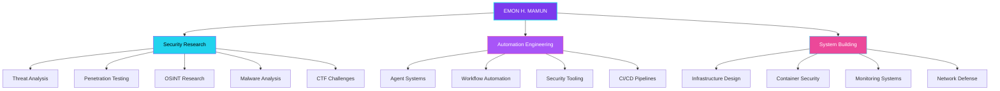

<div align="center">


<a href="https://git.io/typing-svg"></a>

<p>


</p>
<p>


</p>

<table><tr>
<td width="58%" valign="middle">
<a href="https://github.com/piyushsuthar/github-readme-quotes"></a><br/>

</td>
<td width="42%" valign="middle">
<br/>
<br/>

</td></tr></table>

</div>


---

<div align="center">

###   &nbsp;WHO AM I &nbsp; 

```python
class EmonHMamun:
    """Security Researcher | Automation Architect | System Builder"""
    def __init__(self):
        self.base           = "Bangladesh 🇧🇩"
        self.languages      = ["Python", "JavaScript", "TypeScript", "Bash", "Go"]
        self.domains        = ["Security Research", "Automation", "Systems Engineering"]
        self.philosophy     = "I build what watches the perimeter."
        self.motto          = "Curiosity-driven, not profession-defined."
        self.currently      = "Building autonomous defense systems"
```

</div>

---

<div align="center">

### ⚡ TECH ARSENAL

<a href="https://skillicons.dev"></a>

<br/>


</div>

---

<div align="center">

### 📊 STATS & ANALYTICS

<table><tr>
<td>

</td>
<td>

</td>
<td>

</td>
</tr></table>

</div>

---

<div align="center">

### 🌌 CONTRIBUTION GALAXY


<br/>

<br/>


</div>

---

<div align="center">

### 🏆 ACHIEVEMENT HALL


</div>

---

<div align="center">

<a href="https://git.io/typing-svg"></a>

</div>

---

<div align="center">

### 🎮 FUN ZONE


<br/>

<table><tr>
<td width="50%" align="center">

<details><summary>🐸 <b>🐍 Snake Game — Try It!</b></summary><br/>

> 🎯 **How to Play:** Click the link below and use arrow keys to control the snake on any GitHub profile with snake animation!
>
> 🕹️ The snake grows as you contribute more. Your contribution graph becomes the game board!
>
> <a href="https://github.com/emonhmamun"></a>
>
> 🏆 **Pro Tip:** The snake animation below is generated by your real GitHub contributions!


</details>

</td>
<td width="50%" align="center">

<details><summary>🎲 <b>Random Dev Quote Generator</b></summary><br/>

> 💡 **Every 10 minutes** the quote at the top of my profile automatically refreshes with a new developer quote!
>
> 🔄 Powered by [github-readme-quotes](https://github.com/piyushsuthar/github-readme-quotes)
>
> <a href="https://quotes-github-readme.vercel.app/api?type=horizontal&theme=dark"></a>
>
> 📖 **Total Quotes in Rotation:** 200+

</details>

</td>
</tr></table>

</div>

---

<div align="center">

### 🔧 SKILL LEVELS

<table><tr>
<td width="50%">

```
🖥️  Languages
━━━━━━━━━━━━━━━━━━━━━━
Python         ████████████░░ 90%
JavaScript     █████████░░░░  75%
TypeScript     ████████░░░░░  70%
Bash/Shell     ██████████░░░  80%
Go             ██████░░░░░░░  55%
PowerShell     ██████░░░░░░░  55%
YAML           ████████░░░░░  70%
```

</td>
<td width="50%">

```
🛠️  Frameworks & Tools
━━━━━━━━━━━━━━━━━━━━━━━━━━
React/Next.js  ████████░░░░░  70%
Tailwind CSS   █████████░░░░  80%
Docker         █████████░░░░  80%
Linux/Arch     ██████████░░░  85%
Neovim         ████████░░░░░  70%
AWS/Cloud      ███████░░░░░░  65%
Kubernetes     ██████░░░░░░░  55%
Prisma/DB      ███████░░░░░░  65%
```

</td>
</tr></table>

</div>

---

<details>
<summary><h3>🗺️ Security Architecture</h3></summary>



</details>

<details>
<summary><h3>🎯 Current Focus</h3></summary>

| Domain | Direction | Status |
|:------:|:---------:|:------:|
| Security Research | Threat analysis, OSINT, penetration testing | 🟣 Active |
| Automation Systems | Building autonomous security & workflow tools | 🔵 Building |
| System Architecture | Designing secure, resilient infrastructure | 🟣 Exploring |
| AI Integration | Applying ML/AI to security analysis & automation | 🩷 Experimenting |
| Container Security | Docker/K8s hardening & runtime protection | 🟢 Learning |
| Tool Development | Custom security & automation CLI tools | 🟡 Prototyping |

</details>

<details>
<summary><h3>📦 Featured Repositories</h3></summary>

<table><tr>
<td width="50%">

<a href="https://github.com/emonhmamun/CleanSweep-Pro">
  
</a>

</td>
<td width="50%">

<a href="https://github.com/emonhmamun/NeoMate-Agent-AI">
  
</a>

</td>
</tr></table>

</details>

<details>
<summary><h3>🔗 Recommended Tools</h3></summary>

| Tool | Purpose | Why |
|:-----|:--------|:----|
| [**Nuclei**](https://github.com/projectdiscovery/nuclei) | Vulnerability scanner | Fast, template-based, community-driven |
| [**Nmap**](https://nmap.org/) | Network discovery | Swiss army knife of network security |
| [**Burp Suite**](https://portswigger.net/burp/communitydownload) | Web proxy | Essential for web app testing |
| [**Grafana**](https://grafana.com/) | Monitoring | Beautiful data visualization |
| [**n8n**](https://n8n.io/) | Workflow automation | Visual, self-hosted, powerful |
| [**Neovim**](https://neovim.io/) | Code editor | Extensible, terminal-native, fast |
| [**Docker**](https://www.docker.com/) | Containers | Isolated, reproducible environments |
| [**Wireshark**](https://www.wireshark.org/) | Packet analysis | Deep network traffic inspection |

</details>

<details>
<summary><h3>❓ FAQ</h3></summary>

<details>
<summary><strong>Are you available for collaboration?</strong></summary>

Open to collaboration on security research, automation projects, and open-source tooling. Reach out via Telegram or email.
</details>

<br/>

<details>
<summary><strong>What editor and OS do you use?</strong></summary>

Neovim for quick edits, VS Code for larger projects. Linux (Arch/Debian) as primary OS.
</details>

<br/>

<details>
<summary><strong>How do you learn cybersecurity?</strong></summary>

Hands-on. HTB boxes, CTF challenges, reading source code, building tools for my own problems.
</details>

<br/>

<details>
<summary><strong>What's your take on AI in security?</strong></summary>

AI is a force multiplier, not a replacement. I use LLMs for code assistance and threat analysis. But human intuition for creative exploitation stays human.
</details>

<br/>

<details>
<summary><strong>Why "Building what watches the perimeter"?</strong></summary>

Most people build things behind the perimeter. I build the perimeter itself. My interest is in the systems that defend, monitor, and respond — the autonomous layers.
</details>

</details>

---

<div align="center">

### 📡 CONNECT

<a href="https://github.com/emonhmamun"></a>
<a href="https://www.facebook.com/emonhasanmamun.m"></a>
<a href="https://t.me/+8801767953971"></a>
<a href="mailto:ehm.businessbd@gmail.com"></a>

</div>

---

<div align="center">


</div>
