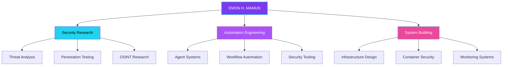

<div align="center">


<a href="https://git.io/typing-svg">
  
</a>

<p>
  
  
  
</p>

<p>
  
  
  
</p>

<table>
<tr>
<td width="58%" valign="middle">

<a href="https://github.com/piyushsuthar/github-readme-quotes">
  
</a>

<br/>


</td>
<td width="42%" valign="middle">

<br/><br/>
<br/><br/>


</td>
</tr>
</table>

</div>


---

```python
class EmonHMamun:
    """Security Researcher | Automation Architect | System Builder"""
    def __init__(self):
        self.base           = "Bangladesh 🇧🇩"
        self.languages      = ["Python", "JavaScript", "TypeScript", "Bash", "Go"]
        self.domains        = ["Security Research", "Automation", "Systems Engineering"]
        self.philosophy     = "I build what watches the perimeter."
```

---

<div align="center">


<br/><br/>

<a href="https://skillicons.dev">
  
</a>

<br/><br/>


</div>

---

<div align="center">

### 📊 CONTRIBUTION GALAXY


<div id="lang-fallback" style="display:none">
<br/>


</div>

<br/><br/>


<br/><br/>


<br/><br/>


</div>

---

<div align="center">

<a href="https://git.io/typing-svg">
  
</a>

</div>

---

<details>
<summary><h3>🗺️ Security Architecture</h3></summary>



</details>

<details>
<summary><h3>🎯 Current Focus</h3></summary>

| Domain | Direction | Status |
|:------:|:---------:|:------:|
| Security Research | Threat analysis, OSINT, penetration testing | 🟣 Active |
| Automation Systems | Building autonomous security and workflow tools | 🔵 Building |
| System Architecture | Designing secure, resilient infrastructure | 🟣 Exploring |
| AI Integration | Applying ML/AI to security analysis and automation | 🩷 Experimenting |

</details>

<details>
<summary><h3>🔗 Recommended Tools</h3></summary>

| Tool | Purpose | Why |
|:-----|:--------|:----|
| [**Nuclei**](https://github.com/projectdiscovery/nuclei) | Vulnerability scanner | Fast, template-based, community-driven |
| [**Nmap**](https://nmap.org/) | Network discovery | Swiss army knife of network security |
| [**Burp Suite**](https://portswigger.net/burp/communitydownload) | Web proxy | Essential for web app testing |
| [**Grafana**](https://grafana.com/) | Monitoring | Beautiful data visualization |
| [**n8n**](https://n8n.io/) | Workflow automation | Visual, self-hosted, powerful |
| [**Neovim**](https://neovim.io/) | Code editor | Extensible, terminal-native, fast |

</details>

<details>
<summary><h3>❓ FAQ</h3></summary>

<details>
<summary><strong>Are you available for collaboration?</strong></summary>

Open to collaboration on security research, automation projects, and open-source tooling. Reach out via Telegram or email.
</details>

<br/>

<details>
<summary><strong>What editor and OS do you use?</strong></summary>

Neovim for quick edits, VS Code for larger projects. Linux (Arch/Debian) as primary OS.
</details>

<br/>

<details>
<summary><strong>How do you learn cybersecurity?</strong></summary>

Hands-on. HTB boxes, CTF challenges, reading source code, building tools for my own problems.
</details>

<br/>

<details>
<summary><strong>What's your take on AI in security?</strong></summary>

AI is a force multiplier, not a replacement. I use LLMs for code assistance and threat analysis. But human intuition for creative exploitation stays human.
</details>

</details>

---

<div align="center">

### 📡 CONNECT

<a href="https://github.com/emonhmamun"></a>
<a href="https://www.facebook.com/emonhasanmamun.m"></a>
<a href="https://t.me/+8801767953971"></a>
<a href="mailto:ehm.businessbd@gmail.com"></a>

</div>

---

<div align="center">


</div>
