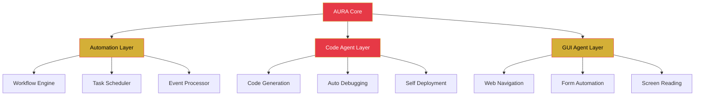

<div align="center">

<!-- Header Banner -->


<!-- Typing SVG -->
<a href="https://git.io/typing-svg">
  
</a>

<!-- Status Badges -->
<p>
  
  
</p>

<!-- Profile Stats -->
<p>
  
  
  
</p>

</div>

---

## 🧠 About Me

```python
class EmonHMamun:
    """Autonomous AI Agent Architect & Cybersecurity Researcher"""
    
    def __init__(self):
        self.name = "EMON H. MAMUN"
        self.role = "AI Agent Architect | Automation | Cybersecurity"
        self.location = "Bangladesh 🇧🇩"
        self.languages = ["Python", "JavaScript", "TypeScript", "Bash", "Go"]
        self.focus = ["Autonomous Agents", "AI Automation", "Cybersecurity"]
    
    def current_project(self):
        return "AURA — Universal Agent Framework"
    
    def philosophy(self):
        return "Every system I build starts as a question: what would this look like if no human had to touch it again?"
    
    def fun_fact(self):
        return "I build what watches back."
```

<div align="center">
  
  
</div>

---

## 🔮 AURA — Universal Agent Framework

> *The future of autonomous AI — a three-layer architecture that doesn't wait for instructions, it finds the work and finishes it.*

| Layer | Role | Key Tech |
|:-----:|:----:|:--------:|
| 🤖 **Automation** | Rule-Based Operations Engine | n8n, Python, Cron, Event Processing |
| 💻 **Code Agent** | Autonomous Coding Agent | LangChain, OpenAI, Self-Debugging, Auto-Deploy |
| 🖥️ **GUI Agent** | Interface Navigation Agent | OCR/DOM, Web Navigation, Click Agent |



---

## 💭 Vision

> *"Every system I build starts as a question: what would this look like if no human had to touch it again? AURA is my answer — an agent that doesn't wait for instructions, it finds the work and finishes it."*

---

## 🛠️ Tech Arsenal

<table>
<tr>
<td align="center" width="25%">

### 🗣️ Languages


</td>
<td align="center" width="25%">

### 🤖 AI / Agents


</td>
<td align="center" width="25%">

### 🔐 Security / Ops


</td>
<td align="center" width="25%">

### ⚡ Tools


</td>
</tr>
</table>

---

## 🐍 Contribution Flow

<picture>
  <source media="(prefers-color-scheme: dark)" srcset="https://raw.githubusercontent.com/emonhmamun/emonhmamun/output/github-snake-dark.svg" />
  <source media="(prefers-color-scheme: light)" srcset="https://raw.githubusercontent.com/emonhmamun/emonhmamun/output/github-snake.svg" />
  
</picture>

---

## 📊 GitHub Metrics

<div align="center">
  
</div>

<div align="center">
  
</div>

---

## 🏆 Achievements

<div align="center">
  
</div>

---

## 🎯 Current Goals

| Goal | Progress | Deadline |
|:----:|:--------:|:--------:|
| 🚀 AURA v0.1 Release | ████████░░ 80% | Q1 2025 |
| 📦 100+ GitHub Repos | ██████░░░░ 60% | 2025 |
| 🔐 Cybersecurity Certs | ████░░░░░░ 40% | 2025 |
| 🤝 Open Source Contributions | ███████░░░ 70% | Ongoing |

---

## 📜 Philosophy

> *"In the space between code and consequence, I build what watches back."*

---

## 🌐 Connect

<p align="center">
  <a href="https://github.com/emonhmamun">
    
  </a>
  <a href="https://www.facebook.com/emonhasanmamun.m">
    
  </a>
  <a href="https://t.me/+8801767953971">
    
  </a>
  <a href="mailto:ehm.businessbd@gmail.com">
    
  </a>
</p>

---

<div align="center">


</div>
